# 开头

入口方法在BeanDefinitionParserDelegate.parseCustomElement：

```Java
return handler.parse(ele, new ParserContext(this.readerContext, this, containingBd));
```

parse方法由各种NamespaceHandler的父类NamespaceHandlerSupport实现:

```Java
@Override
public BeanDefinition parse(Element element, ParserContext parserContext) {
    return findParserForElement(element, parserContext).parse(element, parserContext);
}
```

findParserForElement方法用以寻找适用于此元素的BeanDefinitionParser对象:

```Java
private BeanDefinitionParser findParserForElement(Element element, ParserContext parserContext) {
    String localName = parserContext.getDelegate().getLocalName(element);
    BeanDefinitionParser parser = this.parsers.get(localName);
    if (parser == null) {
        parserContext.getReaderContext().fatal(
            "Cannot locate BeanDefinitionParser for element [" + localName + "]", element);
    }
    return parser;
}
```

localName是个什么东西呢，比如对于context:annotation-config标签就是annotation-config。

# annotation-config

AnnotationConfigBeanDefinitionParser.parse:

```Java
@Override
public BeanDefinition parse(Element element, ParserContext parserContext) {
    //返回null
    Object source = parserContext.extractSource(element);
    // Obtain bean definitions for all relevant BeanPostProcessors.
    Set<BeanDefinitionHolder> processorDefinitions =
            AnnotationConfigUtils.
                registerAnnotationConfigProcessors(parserContext.getRegistry(), source);
    // Register component for the surrounding <context:annotation-config> element.
    CompositeComponentDefinition compDefinition =
        new CompositeComponentDefinition(element.getTagName(), source);
    parserContext.pushContainingComponent(compDefinition);
    // Nest the concrete beans in the surrounding component.
    for (BeanDefinitionHolder processorDefinition : processorDefinitions) {
        parserContext.registerComponent(new BeanComponentDefinition(processorDefinition));
    }
    // Finally register the composite component.
    // 空实现
    parserContext.popAndRegisterContainingComponent();
    return null;
}
```
## BeanPostProcessor注册

AnnotationConfigUtils.registerAnnotationConfigProcessors源码:

```Java
//第一个参数其实就是DefaultListableBeanFactory,第二个参数为null
public static Set<BeanDefinitionHolder> registerAnnotationConfigProcessors(
        BeanDefinitionRegistry registry, Object source) {
    //将registery强转为DefaultListableBeanFactory类型
    DefaultListableBeanFactory beanFactory = unwrapDefaultListableBeanFactory(registry);
    if (beanFactory != null) {
        if (!(beanFactory.getDependencyComparator() instanceof AnnotationAwareOrderComparator)) {
            beanFactory.setDependencyComparator(AnnotationAwareOrderComparator.INSTANCE);
        }
        if (!(beanFactory.getAutowireCandidateResolver() instanceof
            ContextAnnotationAutowireCandidateResolver)) {
            beanFactory.setAutowireCandidateResolver(new ContextAnnotationAutowireCandidateResolver());
        }
    }

    Set<BeanDefinitionHolder> beanDefs = new LinkedHashSet<BeanDefinitionHolder>(4);

    if (!registry.containsBeanDefinition(CONFIGURATION_ANNOTATION_PROCESSOR_BEAN_NAME)) {
        RootBeanDefinition def = new RootBeanDefinition(ConfigurationClassPostProcessor.class);
        def.setSource(source);
        beanDefs.add(registerPostProcessor(registry, def,CONFIGURATION_ANNOTATION_PROCESSOR_BEAN_NAME));
    }

    if (!registry.containsBeanDefinition(AUTOWIRED_ANNOTATION_PROCESSOR_BEAN_NAME)) {
        RootBeanDefinition def = new RootBeanDefinition(AutowiredAnnotationBeanPostProcessor.class);
        def.setSource(source);
        beanDefs.add(registerPostProcessor(registry, def, AUTOWIRED_ANNOTATION_PROCESSOR_BEAN_NAME));
    }

    if (!registry.containsBeanDefinition(REQUIRED_ANNOTATION_PROCESSOR_BEAN_NAME)) {
        RootBeanDefinition def = new RootBeanDefinition(RequiredAnnotationBeanPostProcessor.class);
        def.setSource(source);
        beanDefs.add(registerPostProcessor(registry, def, REQUIRED_ANNOTATION_PROCESSOR_BEAN_NAME));
    }

    // Check for JSR-250 support, and if present add the CommonAnnotationBeanPostProcessor.
    if (jsr250Present && !registry.containsBeanDefinition(COMMON_ANNOTATION_PROCESSOR_BEAN_NAME)) {
        RootBeanDefinition def = new RootBeanDefinition(CommonAnnotationBeanPostProcessor.class);
        def.setSource(source);
        beanDefs.add(registerPostProcessor(registry, def, COMMON_ANNOTATION_PROCESSOR_BEAN_NAME));
    }

    // Check for JPA support, and if present add the PersistenceAnnotationBeanPostProcessor.
    if (jpaPresent && !registry.containsBeanDefinition(PERSISTENCE_ANNOTATION_PROCESSOR_BEAN_NAME)) {
        RootBeanDefinition def = new RootBeanDefinition();
        def.setBeanClass(ClassUtils.forName(PERSISTENCE_ANNOTATION_PROCESSOR_CLASS_NAME,
                AnnotationConfigUtils.class.getClassLoader()));
        def.setSource(source);
        beanDefs.add(registerPostProcessor(registry, def, PERSISTENCE_ANNOTATION_PROCESSOR_BEAN_NAME));
    }

    if (!registry.containsBeanDefinition(EVENT_LISTENER_PROCESSOR_BEAN_NAME)) {
        RootBeanDefinition def = new RootBeanDefinition(EventListenerMethodProcessor.class);
        def.setSource(source);
        beanDefs.add(registerPostProcessor(registry, def, EVENT_LISTENER_PROCESSOR_BEAN_NAME));
    }
    if (!registry.containsBeanDefinition(EVENT_LISTENER_FACTORY_BEAN_NAME)) {
        RootBeanDefinition def = new RootBeanDefinition(DefaultEventListenerFactory.class);
        def.setSource(source);
        beanDefs.add(registerPostProcessor(registry, def, EVENT_LISTENER_FACTORY_BEAN_NAME));
    }

    return beanDefs;
}
```

### AnnotationAwareOrderComparator

其继承体系如下:

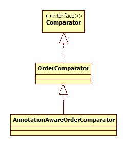

其作用是比较标注了@Order或是javax.annotation.Priority @Priority注解的元素的优先级。这两种注解的一个常用功能就是设置配置加载的优先级。例子可以参考:

[Spring 4.2新特性-使用@Order调整配置类加载顺序](http://www.tuicool.com/articles/VnqUv2)

### ContextAnnotationAutowireCandidateResolver

此类用以决定一个bean是否可以当作一个依赖的候选者。其类图:


### ConfigurationClassPostProcessor

此类用于处理标注了@Configuration注解的类。类图:


### AutowiredAnnotationBeanPostProcessor

此类便用于对标注了@Autowire等注解的bean或是方法进行注入。

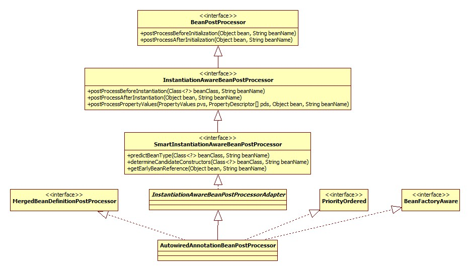

### RequiredAnnotationBeanPostProcessor

对应Spring @Require注解，此注解被用在setter方法上，意味着此setter方法对应的属性必须被Spring所注入，但是不会检查是否是null。其继承体系和上面的AutowiredAnnotationBeanPostProcessor完全一样。

### CommonAnnotationBeanPostProcessor

用于开启对JSR-250的支持，开启的先决条件是当前classpath中有其类，检测的源码:

```Java
private static final boolean jsr250Present =
    ClassUtils.isPresent("javax.annotation.Resource", AnnotationConfigUtils.class.getClassLoader());
```

此注解就在rt.jar下，所以默认情况下都是开启JSR-250支持的，所以我们就可以使用喜闻乐见的@Resource注解了。其类图:


### PersistenceAnnotationBeanPostProcessor

用于提供JPA支持，开启的先决条件仍然是检测classpath下是否有其类存在，源码:

```Java
private static final boolean jpaPresent =
    ClassUtils.isPresent("javax.persistence.EntityManagerFactory",
        AnnotationConfigUtils.class.getClassLoader()) &&
    //org.springframework.orm包
    ClassUtils.isPresent(PERSISTENCE_ANNOTATION_PROCESSOR_CLASS_NAME,
        AnnotationConfigUtils.class.getClassLoader());
```

rt.jar下面并没有JPA的包，所以此Processor默认是没有被注册的。其类图和上面CommonAnnotationBeanPostProcessor如出一辙。

### EventListenerMethodProcessor

提供对于注解@EventListener的支持，此注解在Spring4.2被添加，用于监听ApplicationEvent事件。其继承体系:

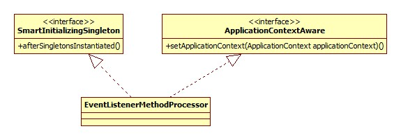

### DefaultEventListenerFactory

此类应该是和上面的配合使用，用以产生EventListener对象，也是从Spring4.2加入，类图:


## 逻辑关系整理

普通的bean元素(XML)其实都有一个BeanDefinition对象与之对应，但是对于context开头的这种的特殊的元素，它所对应的一般不再是普通意义上的BeanDefinition，而是配合起来一起完成某种功能的组件(比如各种BeanPostProcessor)。这种组件Spring抽象成为ComponentDefinition接口，组件的集合表示成为CompositeComponentDefinition，类图:

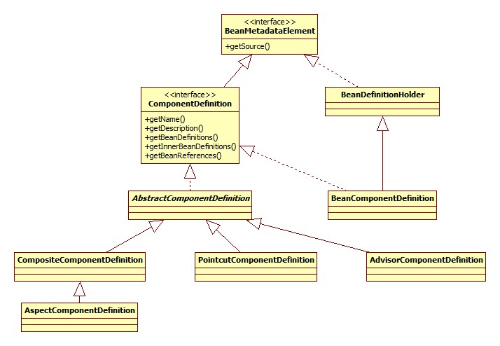

最终形成的数据结构如下图:


不过这个数据结构貌似也没什么用，因为调用的是XmlBeanDefinitionReader中的eventListener的componentRegistered方法，然而这里的eventListener是EmptyReaderEventListener，也就是空实现。

## 运行

### ConfigurationClassPostProcessor

本身是一个BeanFactoryPostProcessor对象，其执行入口在AbstractApplicationContext.refresh方法:

```Java
invokeBeanFactoryPostProcessors(beanFactory);
```

注意，因为ConfigurationClassPostProcessor实现自BeanDefinitionRegistryPostProcessor接口，所以在此处会首先调用其postProcessBeanDefinitionRegistry方法，再调用其postProcessBeanFactory方法。

#### postProcessBeanDefinitionRegistry

此方法大体由两部分组成。

##### BeanPostProcessor注册

此部分源码:

```Java
@Override
public void postProcessBeanDefinitionRegistry(BeanDefinitionRegistry registry) {
    RootBeanDefinition iabpp = new RootBeanDefinition(ImportAwareBeanPostProcessor.class);
    iabpp.setRole(BeanDefinition.ROLE_INFRASTRUCTURE);
    registry.registerBeanDefinition(IMPORT_AWARE_PROCESSOR_BEAN_NAME, iabpp);
    RootBeanDefinition ecbpp = new RootBeanDefinition(EnhancedConfigurationBeanPostProcessor.class);
    ecbpp.setRole(BeanDefinition.ROLE_INFRASTRUCTURE);
    registry.registerBeanDefinition(ENHANCED_CONFIGURATION_PROCESSOR_BEAN_NAME, ecbpp);
}
```

###### ImportAwareBeanPostProcessor

是ConfigurationClassPostProcessor的私有内部类。其类图:

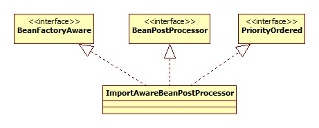

此类用于处理实现了ImportAware接口的类。ImportAware接口是做什么的要从使用java源文件作为Spring配置说起:

有一个类负责生成Student bean:

```Java
@Configuration
public class StudentConfig implements ImportAware {
    @Bean
    public Student student() {
        Student student = new Student();
        student.setAge(22);
        student.setName("skywalker");
        return student;
    }
    @Override
    public void setImportMetadata(AnnotationMetadata importMetadata) {
        System.out.println("importaware");
    }
}
```

生成的bean就以所在的方法名命名。还有一个类负责生成SimpleBean:

```Java
@Configuration
@Import(StudentConfig.class)
public class SimpleBeanConfig {
    @Autowired
    private StudentConfig studentConfig;
    @Bean
    public SimpleBean getSimpleBean() {
        //bean依赖
        SimpleBean simpleBean = new SimpleBean(studentConfig.student());
        return simpleBean;
    }
}
```

启动代码:

```Java
public static void main(String[] args) {
    AnnotationConfigApplicationContext context =
        new AnnotationConfigApplicationContext(SimpleBeanConfig.class);
    SimpleBean simpleBean = context.getBean(SimpleBean.class);
    System.out.println(simpleBean.getStudent().getName());
}
```

所以ImportAware接口的作用就是**使被引用的配置类可以获得引用类的相关信息**。

###### EnhancedConfigurationBeanPostProcessor

用于为实现了EnhancedConfiguration接口的类设置BeanFactory对象，所有的@Configuration Cglib子类均实现了此接口，为什么要这么做不太明白。

##### 类解析

这里便是对标注了@Configuration注解的类及进行解析，通过调用ConfigurationClassPostProcessor的processConfigBeanDefinitions方法来实现，具体怎么解析就不详细说明了。

###### bean名字生成策略

对于配置类，Spring也会将其当作一个bean放到容器中，这就关系到bean的起名了，其实这部分对于@Component, @Controller等注解都是一样的。

ConfigurationClassPostProcessor.processConfigBeanDefinitions相关代码:

```Java
// Detect any custom bean name generation strategy supplied through the enclosing application context
SingletonBeanRegistry singletonRegistry = null;
if (registry instanceof SingletonBeanRegistry) {
    singletonRegistry = (SingletonBeanRegistry) registry;
    if (!this.localBeanNameGeneratorSet &&
        //org.springframework.context.annotation.internalConfigurationBeanNameGenerator
        singletonRegistry.containsSingleton(CONFIGURATION_BEAN_NAME_GENERATOR)) {
            BeanNameGenerator generator = (BeanNameGenerator) singletonRegistry.
            getSingleton(CONFIGURATION_BEAN_NAME_GENERATOR);
        this.componentScanBeanNameGenerator = generator;
        this.importBeanNameGenerator = generator;
    }
}
```

默认是一个AnnotationBeanNameGenerator对象，其类图:


那我们可以通过向Spring容器添加一个自定义BeanNameGenerator对象的方式自定义beanName生成策略吗，答案是不可以，这也是为什么此bean的ID前面以internal开头。从代码上来看，不可以的原因在于BeanFactoryPostProcessor的触发时机: **配置解析、BeanDefinition加载之后，Singleton初始化之前**，所以即使配置了此接口的实现，但是此时此bean尚未初始化，所以根本看不到此实例。

#### postProcessBeanFactory

此方法调用了enhanceConfigurationClasses，其实就是将@Configuration的beanClass转换为CGLIB代理子类。简略版的源码:

```Java
public void enhanceConfigurationClasses(ConfigurableListableBeanFactory beanFactory) {
    Map<String, AbstractBeanDefinition> configBeanDefs =
        new LinkedHashMap<String, AbstractBeanDefinition>();
    //寻找@Configuration的BeanDefinition
    for (String beanName : beanFactory.getBeanDefinitionNames()) {
        BeanDefinition beanDef = beanFactory.getBeanDefinition(beanName);
        if (ConfigurationClassUtils.isFullConfigurationClass(beanDef)) {
            configBeanDefs.put(beanName, (AbstractBeanDefinition) beanDef);
        }
    }
    if (configBeanDefs.isEmpty()) {
        // nothing to enhance -> return immediately
        return;
    }
    ConfigurationClassEnhancer enhancer = new ConfigurationClassEnhancer();
    for (Map.Entry<String, AbstractBeanDefinition> entry : configBeanDefs.entrySet()) {
        AbstractBeanDefinition beanDef = entry.getValue();
        // If a @Configuration class gets proxied, always proxy the target class
        beanDef.setAttribute(AutoProxyUtils.PRESERVE_TARGET_CLASS_ATTRIBUTE, Boolean.TRUE);
        // Set enhanced subclass of the user-specified bean class
        Class<?> configClass = beanDef.resolveBeanClass(this.beanClassLoader);
        Class<?> enhancedClass = enhancer.enhance(configClass, this.beanClassLoader);
        if (configClass != enhancedClass) {
             //替换
            beanDef.setBeanClass(enhancedClass);
        }
    }
}
```

ConfigurationClassEnhancer.newEnhancer:

```Java
private Enhancer newEnhancer(Class<?> superclass, ClassLoader classLoader) {
    Enhancer enhancer = new Enhancer();
    enhancer.setSuperclass(superclass);
    //这里印证了前面EnhancedConfigurationBeanPostProcessor的说明
    enhancer.setInterfaces(new Class<?>[] {EnhancedConfiguration.class});
    enhancer.setUseFactory(false);
    enhancer.setNamingPolicy(SpringNamingPolicy.INSTANCE);
    enhancer.setStrategy(new BeanFactoryAwareGeneratorStrategy(classLoader));
    //关键
    enhancer.setCallbackFilter(CALLBACK_FILTER);
    enhancer.setCallbackTypes(CALLBACK_FILTER.getCallbackTypes());
    return enhancer;
}
```

CALLBACK_FILTER是个什么东西呢:

```Java
private static final ConditionalCallbackFilter CALLBACK_FILTER =
    new ConditionalCallbackFilter(CALLBACKS);

private static final Callback[] CALLBACKS = new Callback[] {
    new BeanMethodInterceptor(),
    new BeanFactoryAwareMethodInterceptor(),
    NoOp.INSTANCE
};
```

这么做的原因有两个:

- 提供Scope支持:

  我们可以使用@Scope注解来使用注解的方式配置其Scope:

  ```Java
  @Bean
  @Scope("prototype")
  public Student student() {
    Student student = new Student();
      student.setAge(22);
      student.setName("skywalker");
      return student;
  }
  ```

  Spring正是通过生成CGLIB子类的方式来提供Scope的语义。更确切的说，是上面源码里面的BeanMethodInterceptor。

- 实现EnhancedConfiguration接口

### AutowiredAnnotationBeanPostProcessor

类图见上面，由于Adapter的存在，真正实现的是postProcessMergedBeanDefinition和postProcessPropertyValues两个方法。

#### postProcessMergedBeanDefinition

##### 入口

其中前者首先被调用，时机是当BeanDefinition被合并(和父Bean)，但是还没有用来创建Bean实例时。回顾下其调用入口:

AbstractAutowireCapableBeanFactory.doCreateBean(简略):

```Java
protected Object doCreateBean(final String beanName, final RootBeanDefinition mbd, final Object[] args) {
    // Instantiate the bean.
    BeanWrapper instanceWrapper = null;
    if (mbd.isSingleton()) {
        instanceWrapper = this.factoryBeanInstanceCache.remove(beanName);
    }
    if (instanceWrapper == null) {
        instanceWrapper = createBeanInstance(beanName, mbd, args);
    }
    final Object bean = (instanceWrapper != null ? instanceWrapper.getWrappedInstance() : null);
    Class<?> beanType = (instanceWrapper != null ? instanceWrapper.getWrappedClass() : null);
    // Allow post-processors to modify the merged bean definition.
    synchronized (mbd.postProcessingLock) {
        if (!mbd.postProcessed) {
            applyMergedBeanDefinitionPostProcessors(mbd, beanType, beanName);
            mbd.postProcessed = true;
        }
    }
}
```

applyMergedBeanDefinitionPostProcessors:

```Java
protected void applyMergedBeanDefinitionPostProcessors(RootBeanDefinition mbd, Class<?> beanType,
    String beanName) {
    for (BeanPostProcessor bp : getBeanPostProcessors()) {
        if (bp instanceof MergedBeanDefinitionPostProcessor) {
            MergedBeanDefinitionPostProcessor bdp = (MergedBeanDefinitionPostProcessor) bp;
            bdp.postProcessMergedBeanDefinition(mbd, beanType, beanName);
        }
    }
}
```

##### 源码

```Java
@Override
public void postProcessMergedBeanDefinition(RootBeanDefinition beanDefinition, Class<?> beanType, String 	 beanName) {
    if (beanType != null) {
        InjectionMetadata metadata = findAutowiringMetadata(beanName, beanType, null);
        metadata.checkConfigMembers(beanDefinition);
    }

}
```

findAutowiringMetadata:

```Java
private InjectionMetadata findAutowiringMetadata(String beanName, Class<?> clazz, PropertyValues pvs) {
    // Fall back to class name as cache key, for backwards compatibility with custom callers.
    String cacheKey = (StringUtils.hasLength(beanName) ? beanName : clazz.getName());
    // Quick check on the concurrent map first, with minimal locking.
    InjectionMetadata metadata = this.injectionMetadataCache.get(cacheKey);
    if (InjectionMetadata.needsRefresh(metadata, clazz)) {
        synchronized (this.injectionMetadataCache) {
            metadata = this.injectionMetadataCache.get(cacheKey);
            if (InjectionMetadata.needsRefresh(metadata, clazz)) {
                if (metadata != null) {
                    metadata.clear(pvs);
                }
                metadata = buildAutowiringMetadata(clazz);
                this.injectionMetadataCache.put(cacheKey, metadata);
            }
        }
    }
    return metadata;
}
```

injectionMetadataCache是一个ConcurrentHashMap对象，个人认为设置此缓存有以下几个原因:

- 假设有多线程同时调用针对某一个bean的getBean方法，那么这样可以保证只有一个线程执行一次@Autowire注解的扫描工作。
- 对于非singleton(比如prototype)类型的bean，这样同样可以保证只解析一次，防止做无用功。

可以看到，Spring使用了代价更小的ConcurrentHashMap来先做一个预检测，这样尽可能的减小锁的使用以及粒度，值得借鉴。

@Autowire注解的扫描在buildAutowiringMetadata方法:

```Java
private InjectionMetadata buildAutowiringMetadata(final Class<?> clazz) {
    LinkedList<InjectionMetadata.InjectedElement> elements =
        new LinkedList<InjectionMetadata.InjectedElement>();
    Class<?> targetClass = clazz;
    //循环检测父类
    do {
        final LinkedList<InjectionMetadata.InjectedElement> currElements =
                new LinkedList<InjectionMetadata.InjectedElement>();
        ReflectionUtils.doWithLocalFields(targetClass, new ReflectionUtils.FieldCallback() {
            @Override
            public void doWith(Field field) throws IllegalArgumentException, IllegalAccessException {
                AnnotationAttributes ann = findAutowiredAnnotation(field);
                if (ann != null) {
                      //不支持静态变量
                    if (Modifier.isStatic(field.getModifiers())) {
                        return;
                    }
                    boolean required = determineRequiredStatus(ann);
                    currElements.add(new AutowiredFieldElement(field, required));
                }
            }
        });
        ReflectionUtils.doWithLocalMethods(targetClass, new ReflectionUtils.MethodCallback() {
            @Override
            public void doWith(Method method) throws IllegalArgumentException, IllegalAccessException {
                Method bridgedMethod = BridgeMethodResolver.findBridgedMethod(method);
                if (!BridgeMethodResolver.isVisibilityBridgeMethodPair(method, bridgedMethod)) {
                    return;
                }
                AnnotationAttributes ann = findAutowiredAnnotation(bridgedMethod);
                if (ann != null && method.equals(ClassUtils.getMostSpecificMethod(method, clazz))) {
                    if (Modifier.isStatic(method.getModifiers())) {
                        return;
                    }
                    if (method.getParameterTypes().length == 0) {
                        if (logger.isWarnEnabled()) {
                            logger.warn("Autowired annotation should be used on
                                methods with parameters: " + method);
                        }
                    }
                    boolean required = determineRequiredStatus(ann);
                    PropertyDescriptor pd = BeanUtils.findPropertyForMethod(bridgedMethod, clazz);
                    currElements.add(new AutowiredMethodElement(method, required, pd));
                }
            }
        });
        elements.addAll(0, currElements);
        targetClass = targetClass.getSuperclass();
    }
    while (targetClass != null && targetClass != Object.class);
    return new InjectionMetadata(clazz, elements);
}
```

可以看出，Spring使用了一个do while循环来一直检测其父类，直到Object，这就说明，**Spring注入注解可以配置在此bean的父类上**。其实，最开始的时候网站的Service层和Dao层一直都是这么做的。

##### 变量扫描

之后便是逐一扫描当前类的成员变量，检测是否有@Autowire注解。

ReflectionUtils的实现其实就是访问者模式，其源码:

```Java
public static void doWithLocalFields(Class<?> clazz, FieldCallback fc) {
    for (Field field : getDeclaredFields(clazz)) {
        try {
            fc.doWith(field);
        }
        catch (IllegalAccessException ex) {}
    }
}
```

determineRequiredStatus方法用以判断是否是必须的，所谓的必须是指: 如果容器里没有需要的bean，那么会抛出异常，否则就忽略了，默认是必须的。原理很简单，不说了。

##### 方法扫描

###### bridge方法

就是方法扫描的第一行源码:

```Java
Method bridgedMethod = BridgeMethodResolver.findBridgedMethod(method);
```

此句代码的作用是**判断method是否是bridge方法，如果是，寻找其真正的方法。**这里的bridge方法并不是所谓的bridge模式。

有这样的demo代码:

```Java
public class JavaTest {
    private class MyList extends ArrayList {
        //注意父类的返回类型是Object
        @Override
        public String get(int index) {
            return "";
        }
    }
    public static void main(String[] args) {
        for (Method method : MyList.class.getDeclaredMethods()) {
            System.out.println("name: " + method.getName() + ", return: " + method.getReturnType());
        }
    }
}
```

子类重写父类的方法但是返回值不同在java语言里是合法的。此程序的输出:

```html
name: get, return: class java.lang.String
name: get, return: class java.lang.Object
```

通过javap反编译命令也可以看到有两个get方法。其中返回Object的便是bridge方法。jdk从1.5开始便提供了方法判断是否是此种方法: Method:

```Java
/**
 * Returns {@code true} if this method is a bridge
 * method; returns {@code false} otherwise.
 *
 * @return true if and only if this method is a bridge
 * method as defined by the Java Language Specification.
 * @since 1.5
 */
public boolean isBridge() {
    return (getModifiers() & Modifier.BRIDGE) != 0;
}
```

可以看出，bridge和static之类一样，在java内部也是有一个修饰符的，只不过只在jvm内部可见。

可以参考: [Java那些不为人知的特殊方法](http://ifeve.com/syntethic-and-bridge-methods/)

到这里寻找真正方法的原理也好理解了，就是在所有Method中寻找方法名相同、参数列表相同但返回值不同的。

###### PropertyDescriptor

用于描述java bean，如果被标注@Autowire的方法是一个getter或setter方法，那么Spring会保存下来其PropertyDescriptor对象，如果不是，那么就是空。

#### postProcessPropertyValues

##### 入口

AbstractAutowireCapableBeanFactory.populateBean方法，执行时机是在bean的属性都已经计算(根据xml配置进行完autowire)完毕，设置到bean实例之前。

##### 注入

源码:

```Java
public void processInjection(Object bean) throws BeansException {
    Class<?> clazz = bean.getClass();
     // 查找缓存
    InjectionMetadata metadata = findAutowiringMetadata(clazz.getName(), clazz, null);
    metadata.inject(bean, null, null);
}
```

根据上面postProcessMergedBeanDefinition一节的说明，解析的结果最终保存为一个InjectionMetadata对象，其内部含有一个InjectionMetadata.InjectedElement类型的List，所以注入的过程实际上便是遍历此List调用每一个InjectionMetadata.InjectedElement的inject的过程。

###### Field注入

实现类是AutowiredFieldElement。注入的原理就是从容器中查找相关的依赖，用反射的方法调用Field的set方法，不在详细说了。

###### 方法注入

实现类是AutowiredMethodElement。注入的原理是遍历此方法的参数列表，针对每一个参数都去容器中寻找相应的bean，之后调用Method的invoke方法即可。

### RequiredAnnotationBeanPostProcessor

上面提到了，此类的类图和上面的邻居类似，所以调用的方法的顺序、时机都是一样，所以不再赘述。

#### postProcessMergedBeanDefinition

空实现，就是这么任性:

```Java
@Override
public void postProcessMergedBeanDefinition(RootBeanDefinition beanDefinition, Class<?> beanType, String 	beanName) {
}
```

#### postProcessPropertyValues

源码:

```Java
@Override
public PropertyValues postProcessPropertyValues(
        PropertyValues pvs, PropertyDescriptor[] pds, Object bean, String beanName)
        throws BeansException {
    if (!this.validatedBeanNames.contains(beanName)) {
        if (!shouldSkip(this.beanFactory, beanName)) {
            List<String> invalidProperties = new ArrayList<String>();
            for (PropertyDescriptor pd : pds) {
                if (isRequiredProperty(pd) && !pvs.contains(pd.getName())) {
                    invalidProperties.add(pd.getName());
                }
            }
            if (!invalidProperties.isEmpty()) {
                throw new BeanInitializationException(buildExceptionMessage
                    (invalidProperties, beanName));
            }
        }
        this.validatedBeanNames.add(beanName);
    }
    return pvs;
}
```

##### 结果缓存

validatedBeanNames是一个Set<String>类型，对于已经检查过的bean，将其name加入Set，防止做无用功。

##### PropertyDescriptor

从源码可以看出，校验是通过PropertyDescriptor完成的，那么这个数组是从哪里来的呢?

AbstractAutowireCapableBeanFactory.populateBean相关代码:

```Java
PropertyDescriptor[] filteredPds = filterPropertyDescriptorsForDependencyCheck(bw, mbd.allowCaching);
if (hasInstAwareBpps) {
    for (BeanPostProcessor bp : getBeanPostProcessors()) {
        if (bp instanceof InstantiationAwareBeanPostProcessor) {
            InstantiationAwareBeanPostProcessor ibp = (InstantiationAwareBeanPostProcessor) bp;
            pvs = ibp.postProcessPropertyValues(pvs, filteredPds, bw.getWrappedInstance(), beanName);
            if (pvs == null) {
                return;
            }
        }
    }
}
```

filterPropertyDescriptorsForDependencyCheck单参数方法:

```Java
protected PropertyDescriptor[] filterPropertyDescriptorsForDependencyCheck(BeanWrapper bw) {
    List<PropertyDescriptor> pds =
            new LinkedList<PropertyDescriptor>(Arrays.asList(bw.getPropertyDescriptors()));
    for (Iterator<PropertyDescriptor> it = pds.iterator(); it.hasNext();) {
        PropertyDescriptor pd = it.next();
        if (isExcludedFromDependencyCheck(pd)) {
            it.remove();
        }
    }
    return pds.toArray(new PropertyDescriptor[pds.size()]);
}
```

可以看出，最终来自于BeanWrapper。那么BeanWrapper又是从哪里弄来的呢?

BeanWrapperImpl.getPropertyDescriptors:

```Java
@Override
public PropertyDescriptor[] getPropertyDescriptors() {
    return getCachedIntrospectionResults().getPropertyDescriptors();
}
private CachedIntrospectionResults getCachedIntrospectionResults() {
    Assert.state(getWrappedInstance() != null, "BeanWrapper does not hold a bean instance");
    if (this.cachedIntrospectionResults == null) {
        this.cachedIntrospectionResults = CachedIntrospectionResults.forClass(getWrappedClass());
    }
    return this.cachedIntrospectionResults;
}
```

所以，这时BeanWrapper便会把自己"内省"一遍。这从侧面说明@Reqired注解只对setter方法有效。

##### 测试

有一个bean如下:

```Java
@Component("simpleBean")
public class SimpleBean {
    @Autowired(required = false)
    private Student student;

    public SimpleBean() {}

    public SimpleBean(Student student) {
        this.student = student;
    }
    public Student getStudent() {
        return student;
    }
    @Required
    public void setStudent(Student student) {
        this.student = student;
    }
}
```

注意先关闭@Autowire的检测，否则用不到@Required注解便会报错。运行之后的结果:


### CommonAnnotationBeanPostProcessor

从其类图可以看出，此类主要是整合了MergedBeanDefinitionPostProcessor和DestructionAwareBeanPostProcessor的功能。其功能体现在以下几个方法，按调用顺序进行说明。

#### postProcessMergedBeanDefinition

此方法的执行入口以及调用时机上面已经说过了。其源码:

```Java
@Override
public void postProcessMergedBeanDefinition(RootBeanDefinition beanDefinition, Class<?> beanType, String 	 beanName) {
    super.postProcessMergedBeanDefinition(beanDefinition, beanType, beanName);
    if (beanType != null) {
        InjectionMetadata metadata = findResourceMetadata(beanName, beanType, null);
        metadata.checkConfigMembers(beanDefinition);
    }
}
```

##### 父类

可以看出，首先调用了其父类InitDestroyAnnotationBeanPostProcessor的postProcessMergedBeanDefinition方法，源码:

```Java
@Override
public void postProcessMergedBeanDefinition(RootBeanDefinition beanDefinition, Class<?> beanType, String 	 beanName) {
    if (beanType != null) {
        LifecycleMetadata metadata = findLifecycleMetadata(beanType);
        metadata.checkConfigMembers(beanDefinition);
    }
}
```

findLifecycleMetadata的套路和上面运行-AutowiredAnnotationBeanPostProcessor-源码一节中所说完全一样，所不同的是此处是**遍历所有method寻找初始化和销毁方法标记**。这两个标记很有意思，Spring允许我们自定义是哪两个标记(getter/setter方法)。子类CommonAnnotationBeanPostProcessor在构造器中设置了其值:

```Java
public CommonAnnotationBeanPostProcessor() {
    setInitAnnotationType(PostConstruct.class);
    setDestroyAnnotationType(PreDestroy.class);
}
```

这两个标签来自于javax.annotation包。那么怎么自定义呢?

CommonAnnotationBeanPostProcessor本质上是一个BeanPostProcessor，所以我们可以自己注入，配置文件:

```xml
<bean class="org.springframework.context.annotation.CommonAnnotationBeanPostProcessor">
    <property name="initAnnotationType" value="annotation.Init" />
</bean>
```

Init是一个很简单的自定义注解:

```Java
@Retention(RetentionPolicy.RUNTIME)
@Target(ElementType.METHOD)
public @interface Init {}
```

在自己的bean中使用此注解:

```Java
@Init
public void init() {
    System.out.println("Init!");
}
```

运行Spring便可以看到效果。

另外注意一点，从前面annotation-config-BeanPostProcessor注册一节的源码中可以看出，**Spring在向容器中添加CommonAnnotationBeanPostProcessor时只是检测其ID(org.springframework.context.annotation.internalCommonAnnotationProcessor)是否存在，这就造成了一个问题: 如果按上面所说的配置，那么在容器中实际上有两个CommonAnnotationProcessor存在，也就是说，@PostConstruct和@PreDestroy注解此时依然被支持**。为了达到只有一个实例的目的，需要为前面的配置加上ID。

##### 子类

findResourceMetadata的套路还是一样，就是在属性和方法上寻找@Resource标签。

#### postProcessPropertyValues

源码:

```Java
@Override
public PropertyValues postProcessPropertyValues(
        PropertyValues pvs, PropertyDescriptor[] pds, Object bean, String beanName) {
    InjectionMetadata metadata = findResourceMetadata(beanName, bean.getClass(), pvs);
    metadata.inject(bean, beanName, pvs);
    return pvs;
}
```

套路很明显了。

#### postProcessBeforeInitialization

实现在父类InitDestroyAnnotationBeanPostProcessor：

```Java
@Override
public Object postProcessBeforeInitialization(Object bean, String beanName) {
    LifecycleMetadata metadata = findLifecycleMetadata(bean.getClass());
    metadata.invokeInitMethods(bean, beanName);
    return bean;
}
```

invokeInitMethods:

```Java
public void invokeInitMethods(Object target, String beanName) throws Throwable {
    Collection<LifecycleElement> initMethodsToIterate =
            (this.checkedInitMethods != null ? this.checkedInitMethods : this.initMethods);
    if (!initMethodsToIterate.isEmpty()) {
        for (LifecycleElement element : initMethodsToIterate) {
             // 反射调用
            element.invoke(target);
        }
    }
}
```

不过从源码来看应该支持多个init方法。

#### postProcessBeforeDestruction

反射调用销毁方法，没啥说的了。

### EventListenerMethodProcessor

就一个值得关注的方法: afterSingletonsInstantiated。

##### 入口

DefaultListableBeanFactory.preInstantiateSingletons相关源码:

```Java
// Trigger post-initialization callback for all applicable beans...
for (String beanName : beanNames) {
    Object singletonInstance = getSingleton(beanName);
    if (singletonInstance instanceof SmartInitializingSingleton) {
        final SmartInitializingSingleton smartSingleton =
            (SmartInitializingSingleton) singletonInstance;
        if (System.getSecurityManager() != null) {
            AccessController.doPrivileged(new PrivilegedAction<Object>() {
                @Override
                public Object run() {
                    smartSingleton.afterSingletonsInstantiated();
                    return null;
                }
            }, getAccessControlContext());
        } else {
            smartSingleton.afterSingletonsInstantiated();
        }
    }
}
```

##### 源码

略过。

# component-scan

ComponentScanBeanDefinitionParser.parse源码:

```Java
@Override
public BeanDefinition parse(Element element, ParserContext parserContext) {
    // base-package属性
    String basePackage = element.getAttribute(BASE_PACKAGE_ATTRIBUTE);
    // 解析占位符
    basePackage = parserContext.getReaderContext().getEnvironment()
        .resolvePlaceholders(basePackage);
    //分割成数据
    String[] basePackages = StringUtils.tokenizeToStringArray(basePackage,
            ConfigurableApplicationContext.CONFIG_LOCATION_DELIMITERS);
    // Actually scan for bean definitions and register them.
    ClassPathBeanDefinitionScanner scanner = configureScanner(parserContext, element);
    Set<BeanDefinitionHolder> beanDefinitions = scanner.doScan(basePackages);
    registerComponents(parserContext.getReaderContext(), beanDefinitions, element);
    return null;
}
```

## 初始化

此部分负责初始化包扫描用到的扫描器，是一个ClassPathBeanDefinitionScanner对象，configureScanner方法源码:

```Java
protected ClassPathBeanDefinitionScanner configureScanner(ParserContext parserContext, Element element) {
    boolean useDefaultFilters = true;
    if (element.hasAttribute(USE_DEFAULT_FILTERS_ATTRIBUTE)) {
        useDefaultFilters = Boolean.valueOf(element.getAttribute(USE_DEFAULT_FILTERS_ATTRIBUTE));
    }

    // Delegate bean definition registration to scanner class.
    ClassPathBeanDefinitionScanner scanner = createScanner
        (parserContext.getReaderContext(), useDefaultFilters);
    scanner.setResourceLoader(parserContext.getReaderContext().getResourceLoader());
    scanner.setEnvironment(parserContext.getReaderContext().getEnvironment());
    scanner.setBeanDefinitionDefaults(parserContext.getDelegate().getBeanDefinitionDefaults());
    scanner.setAutowireCandidatePatterns(parserContext.getDelegate().getAutowireCandidatePatterns());

    if (element.hasAttribute(RESOURCE_PATTERN_ATTRIBUTE)) {
        scanner.setResourcePattern(element.getAttribute(RESOURCE_PATTERN_ATTRIBUTE));
    }

    parseBeanNameGenerator(element, scanner);

    parseScope(element, scanner);

    parseTypeFilters(element, scanner, parserContext);
    return scanner;
}
```

下面开始按顺序分部分说明。

### use-default-filters

component-scan注解会默认扫描喜闻乐见的@Component、@Repository、@Service和@Controller四大金刚。如果此属性设为false，那么就不会扫描这几个属性。

### 扫描器:创建 & 初始化

就是createScanner方法和下面那一坨setter方法，没啥好说的。

### resource-pattern

用以配置扫描器扫描的路径，默认`**/*.class`。

### name-generator

可以指定命名策略，这个在前面运行-ConfigurationClassPostProcessor-类解析一节中说过。Spring在parseBeanNameGenerator方法会直接使用反射的方法生成其对象。

### scope-resolver

指定使用的ScopeMetadataResolver。此接口用于解析bean的scope定义，其类图:

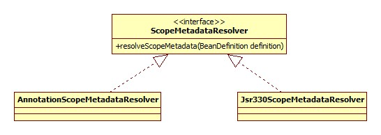

默认是AnnotationScopeMetadataResolver，也就是解析@Scope标签。

### scoped-proxy

此配置的意思应该是是否为检测到的bean生成代理子类，共有三个选项: interfaces, no, targetClasses，默认no。原理应该就像对@Configuration类的处理，Spring自己说是实现proxy style，不知所云。

### exclude-filter/include-filter

用法示例:

```xml
<context:component-scan base-package="base">
    <context:exclude-filter type="annotation" expression="javax.annotation.Resource" />
</context:component-scan>
```

parseTypeFilters方法负责此部分的解析，只贴部分源码:

```Java
if (INCLUDE_FILTER_ELEMENT.equals(localName)) {
    TypeFilter typeFilter = createTypeFilter((Element) node, classLoader, parserContext);
    scanner.addIncludeFilter(typeFilter);
} else if (EXCLUDE_FILTER_ELEMENT.equals(localName)) {
    TypeFilter typeFilter = createTypeFilter((Element) node, classLoader, parserContext);
    scanner.addExcludeFilter(typeFilter);
}
```

### annotation-config

此属性等同于<context:annotation-config />配置，默认就是true，也就是说，如果配置了context:component-scan其实就没有必要配置annotation-config 了。

## 扫描

入口方法便是ClassPathBeanDefinitionScanner.doScan:

```Java
protected Set<BeanDefinitionHolder> doScan(String... basePackages) {
    Assert.notEmpty(basePackages, "At least one base package must be specified");
    Set<BeanDefinitionHolder> beanDefinitions = new LinkedHashSet<BeanDefinitionHolder>();
    for (String basePackage : basePackages) {
         // 逐包扫描
        Set<BeanDefinition> candidates = findCandidateComponents(basePackage);
        for (BeanDefinition candidate : candidates) {
            ScopeMetadata scopeMetadata = this.scopeMetadataResolver.resolveScopeMetadata(candidate);
            candidate.setScope(scopeMetadata.getScopeName());
            String beanName = this.beanNameGenerator.generateBeanName(candidate, this.registry);
            if (candidate instanceof AbstractBeanDefinition) {
                 // 为BeanDefinition设置默认的属性
                postProcessBeanDefinition((AbstractBeanDefinition) candidate, beanName);
            }
            if (candidate instanceof AnnotatedBeanDefinition) {
                AnnotationConfigUtils.processCommonDefinitionAnnotations
                    ((AnnotatedBeanDefinition) candidate);
            }
            if (checkCandidate(beanName, candidate)) {
                BeanDefinitionHolder definitionHolder = new BeanDefinitionHolder(candidate, beanName);
                definitionHolder = AnnotationConfigUtils.applyScopedProxyMode
                    (scopeMetadata, definitionHolder, this.registry);
                beanDefinitions.add(definitionHolder);
                registerBeanDefinition(definitionHolder, this.registry);
            }
        }
    }
    return beanDefinitions;
}
```

### 逐包扫描/BeanDefinition解析

扫描其实就是在classpath下直接读取class文件。读取到的class文件被Spring用Resource接口表示。之后交由MetadataReader进行解析，其类图:

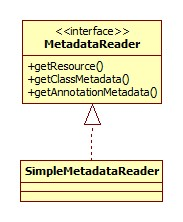

对class文件的读取、分析是通过ASM完成的，入口在SimpleMetadataReader的构造器:

```Java
SimpleMetadataReader(Resource resource, ClassLoader classLoader) throws IOException {
    InputStream is = new BufferedInputStream(resource.getInputStream());
    ClassReader classReader;
    classReader = new ClassReader(is);

    AnnotationMetadataReadingVisitor visitor = new AnnotationMetadataReadingVisitor(classLoader);
    classReader.accept(visitor, ClassReader.SKIP_DEBUG);

    this.annotationMetadata = visitor;
    // (since AnnotationMetadataReadingVisitor extends ClassMetadataReadingVisitor)
    this.classMetadata = visitor;
    this.resource = resource;
}
```

解析的关键便在于AnnotationMetadataReadingVisitor，其类图:

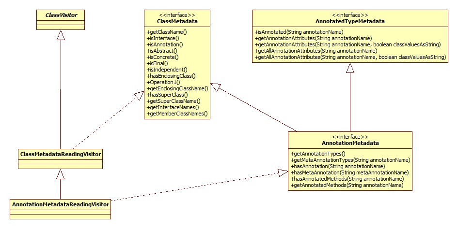

核心在于其visitAnnotation方法:

```Java
@Override
public AnnotationVisitor visitAnnotation(final String desc, boolean visible) {
    String className = Type.getType(desc).getClassName();
    this.annotationSet.add(className);
    return new AnnotationAttributesReadingVisitor(
        className, this.attributesMap, this.metaAnnotationMap, this.classLoader);
}
```

返回一个AnnotationVisitor表示对此注解的属性感兴趣，用于解析其属性。最终得到的BeanDefinition集合是ScannedGenericBeanDefinition类型，其类图:

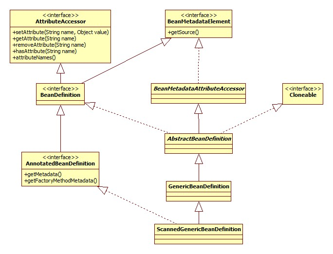

### @Scope解析

AnnotationScopeMetadataResolver.resolveScopeMetadata:

```Java
@Override
public ScopeMetadata resolveScopeMetadata(BeanDefinition definition) {
    ScopeMetadata metadata = new ScopeMetadata();
    if (definition instanceof AnnotatedBeanDefinition) {
        AnnotatedBeanDefinition annDef = (AnnotatedBeanDefinition) definition;
         // 寻找Scope相关的属性，AnnotationAttributes是LinkedHashMap的子类
        AnnotationAttributes attributes = AnnotationConfigUtils.attributesFor(
                annDef.getMetadata(), this.scopeAnnotationType);
        if (attributes != null) {
             // @Scope值
            metadata.setScopeName(attributes.getString("value"));
            ScopedProxyMode proxyMode = attributes.getEnum("proxyMode");
            if (proxyMode == null || proxyMode == ScopedProxyMode.DEFAULT) {
                proxyMode = this.defaultProxyMode;
            }
            metadata.setScopedProxyMode(proxyMode);
        }
    }
    return metadata;
}
```

proxyMode和xml的scoped-proxy属性是一个概念:

```Java
@Scope(value = "singleton", proxyMode = ScopedProxyMode.DEFAULT)
```

**XML的属性是全局的配置，这个是局部(针对单个bean)的配置**，和XML属性相比对了一个default选项，这个就表示使用XML属性的配置。

### bean名字生成

AnnotationBeanNameGenerator.generateBeanName:

```Java
@Override
public String generateBeanName(BeanDefinition definition, BeanDefinitionRegistry registry) {
    if (definition instanceof AnnotatedBeanDefinition) {
        String beanName = determineBeanNameFromAnnotation((AnnotatedBeanDefinition) definition);
        if (StringUtils.hasText(beanName)) {
            // Explicit bean name found.
            return beanName;
        }
    }
    // Fallback: generate a unique default bean name.
    return buildDefaultBeanName(definition, registry);
}
```

#### 根据注解

默认会首先尝试根据@Component、@Service、@Controller、@Repository、@ManagedBean、@Named的value属性生成，determineBeanNameFromAnnotation:

```Java
protected String determineBeanNameFromAnnotation(AnnotatedBeanDefinition annotatedDef) {
    AnnotationMetadata amd = annotatedDef.getMetadata();
    Set<String> types = amd.getAnnotationTypes();
    String beanName = null;
     // 遍历当前bean拥有的所有类级注解
    for (String type : types) {
         // 获取此注解所有的属性
        AnnotationAttributes attributes = AnnotationConfigUtils.attributesFor(amd, type);
        if (isStereotypeWithNameValue(type, amd.getMetaAnnotationTypes(type), attributes)) {
            Object value = attributes.get("value");
            if (value instanceof String) {
                String strVal = (String) value;
                if (StringUtils.hasLength(strVal)) {
                    if (beanName != null && !strVal.equals(beanName)) {
                        throw new IllegalStateException();
                    }
                    beanName = strVal;
                }
            }
        }
    }
    return beanName;
}
```

isStereotypeWithNameValue方法用于判断此注解是否可以用来生成beanName，比如@Scope便不适合:

```Java
protected boolean isStereotypeWithNameValue(String annotationType,
        Set<String> metaAnnotationTypes, Map<String, Object> attributes) {
    // org.springframework.stereotype.Component
    boolean isStereotype = annotationType.equals(COMPONENT_ANNOTATION_CLASSNAME) ||
        (metaAnnotationTypes != null && metaAnnotationTypes.contains(COMPONENT_ANNOTATION_CLASSNAME)) ||
        annotationType.equals("javax.annotation.ManagedBean") ||
        annotationType.equals("javax.inject.Named");
    return (isStereotype && attributes != null && attributes.containsKey("value"));
}
```

metaAnnotationTypes用以判断元注解，针对这种情况:

```Java
@Component
public @interface Controller {}
```

可以看出，判断是否可以用来生成名字的依据便是注解类型是否在上面提到的6种之列并且value属性不为空。

#### 默认策略

如果上面提到的条件不满足，那么便会用默认策略生成beanName，buildDefaultBeanName：

```Java
protected String buildDefaultBeanName(BeanDefinition definition) {
    // base.SimpleBean -> SimpleBean
    String shortClassName = ClassUtils.getShortName(definition.getBeanClassName());
    //SimpleBean -> simpleBean
    return Introspector.decapitalize(shortClassName);
}
```

注意，对于内部类: OuterClassName.InnerClassName -> outerClassName.InnerClassName.

### 其它注解解析

入口在AnnotationConfigUtils.processCommonDefinitionAnnotations，其它指的是这几个:

```Java
@Lazy
@Primary
@DependsOn("student")
@Role(BeanDefinition.ROLE_APPLICATION)
@Description("This is a simple bean.")
public class SimpleBean {}
```

这里面就是@Role没见过，默认就是上面那个值，Spring说这是一个"hint"，可能没啥卵用，希望不要被打脸。解析之后设置到BeanDefinition，没啥好说的。

### 冲突检测

Spring会检测容器中是否已经存在同名的BeanDefinition。ClassPathBeanDefinitionScanner.checkCandidate:

```Java
protected boolean checkCandidate(String beanName, BeanDefinition beanDefinition) {
    // 没有同名的，直接返回
    if (!this.registry.containsBeanDefinition(beanName)) {
        return true;
    }
    BeanDefinition existingDef = this.registry.getBeanDefinition(beanName);
    BeanDefinition originatingDef = existingDef.getOriginatingBeanDefinition();
    if (originatingDef != null) {
        existingDef = originatingDef;
    }
    if (isCompatible(beanDefinition, existingDef)) {
        return false;
    }
    throw new ConflictingBeanDefinitionException("冲突啦!");
}
```

isCompatible用于判断和之前的BeanDefinition是否兼容:

```Java
protected boolean isCompatible(BeanDefinition newDefinition, BeanDefinition existingDefinition) {
    //// explicitly registered overriding bean
    return (!(existingDefinition instanceof ScannedGenericBeanDefinition) ||
            //// scanned same file twice
            newDefinition.getSource().equals(existingDefinition.getSource()) ||
            // scanned equivalent class twice			
            newDefinition.equals(existingDefinition));  
}
```

可以看出，**如果已经存在的BeanDefinition不是扫描来的，如果是由同一个class文件解析来的，如果两者equals，Spring都认为是兼容的，即Spring会用新的替换之前的。**

### 代理生成

入口: ClassPathBeanDefinitionScanner.doScan:

```Java
BeanDefinitionHolder definitionHolder = new BeanDefinitionHolder(candidate, beanName);
definitionHolder = AnnotationConfigUtils.applyScopedProxyMode(scopeMetadata, definitionHolder, this.registry);
```

AnnotationConfigUtils.applyScopedProxyMode:

```Java
static BeanDefinitionHolder applyScopedProxyMode(
        ScopeMetadata metadata, BeanDefinitionHolder definition, BeanDefinitionRegistry registry) {
    ScopedProxyMode scopedProxyMode = metadata.getScopedProxyMode();
    // 基本都是从这里跑了
    if (scopedProxyMode.equals(ScopedProxyMode.NO)) {
        return definition;
    }
    boolean proxyTargetClass = scopedProxyMode.equals(ScopedProxyMode.TARGET_CLASS);
    return ScopedProxyCreator.createScopedProxy(definition, registry, proxyTargetClass);
}
```

最终调用的是ScopedProxyUtils.createScopedProxy，源码很多，这里说下重点:

- 这里所做的是生成了一个新的BeanDefinition对象，作为代理者，其属性拷贝自被代理者，代理者的beanClass为ScopedProxyFactoryBean，代理者的名字设置为被代理者的名字，而被代理者的名字改为scopedTarget.原名字，代理者内部有一个targetBeanName属性，就是被代理者的名字。
- 被代理者的autowireCandidate和primary属性被设为false，不能再当作其它bean的注入候选者。
- 将被代理者以scopedTarget.原名字注册到容器，返回代理者。
- 代理者和被代理者同时存在于容器中。

可以看出，这其实是一个偷天换日的过程。

做个实验:

```Java
public class Boostrap {
    public static void main(String[] args) {
        ClassPathXmlApplicationContext context = new ClassPathXmlApplicationContext("config.xml");
        SimpleBean bean = SimpleBean.class.cast(context.getBean(SimpleBean.class));
         System.out.println(bean.getClass().getName());
         context.close();
    }
}
```

SimpleBean已开启代理，输出的结果:

```html
base.SimpleBean$$EnhancerBySpringCGLIB$$27256c61
```

那么问题来了，对于以class寻找的方式，必定会找到两个，那么怎么做出选择呢?

DefaultListableBeanFactory.getBean(Class<T> requiredType, Object... args)部分源码:

```Java
String[] beanNames = getBeanNamesForType(requiredType);
//不止一个满足条件(代理者和被代理者)
if (beanNames.length > 1) {
    ArrayList<String> autowireCandidates = new ArrayList<String>();
    for (String beanName : beanNames) {
         // here
        if (!containsBeanDefinition(beanName) || getBeanDefinition(beanName).isAutowireCandidate()) {
            autowireCandidates.add(beanName);
        }
    }
    if (autowireCandidates.size() > 0) {
        beanNames = autowireCandidates.toArray(new String[autowireCandidates.size()]);
    }
}
```

可以看出，是上面提到过的autowireCandidate设为了false的缘故导致了被代理者被pass。

### BeanDefinition注册

你懂的。

## Component注册

套路和annotation-config-逻辑关系整理一节完全一样，不再赘述。

# property-override

## 作用

允许我们使用属性文件(.properties)的形式对bean的属性进行替换。下面是一个简单的demo:

定义如下的属性文件(property.properties):

```properties
student.name=dog
```

格式为: bean名字.属性名字=值。由如下的bean:

```xml
<bean id="student" class="base.Student">
    <property name="name" value="skywalker" />
    <property name="age" value="30" />
</bean>
```

进行如下的配置:

```xml
<context:property-override location="property.properties" />
```

运行如下的代码:

```Java
public static void main(String[] args) {
    ClassPathXmlApplicationContext context = new ClassPathXmlApplicationContext("config.xml");
    SimpleBean bean = SimpleBean.class.cast(context.getBean(SimpleBean.class));
    System.out.println(bean.getStudent().getName());
    context.close();
}
```

打印的便是dog，而不是skywalker。

## 类图

具体的实现类是PropertyOverrideBeanDefinitionParser，其类图如下:

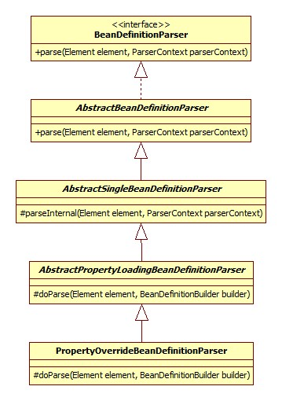

## 解析

解析的原理是将此配置相关的信息保存到BeanDefinition中，更准确的说是一个GenericBeanDefinition。解析的源码:

AbstractPropertyLoadingBeanDefinitionParser.doParse:

```Java
@Override
protected void doParse(Element element, BeanDefinitionBuilder builder) {
    String location = element.getAttribute("location");
    if (StringUtils.hasLength(location)) {
        String[] locations = StringUtils.commaDelimitedListToStringArray(location);
        builder.addPropertyValue("locations", locations);
    }
    String propertiesRef = element.getAttribute("properties-ref");
    if (StringUtils.hasLength(propertiesRef)) {
        builder.addPropertyReference("properties", propertiesRef);
    }
    String fileEncoding = element.getAttribute("file-encoding");
    if (StringUtils.hasLength(fileEncoding)) {
        builder.addPropertyValue("fileEncoding", fileEncoding);
    }
    String order = element.getAttribute("order");
    if (StringUtils.hasLength(order)) {
        builder.addPropertyValue("order", Integer.valueOf(order));
    }
    builder.addPropertyValue("ignoreResourceNotFound",
            Boolean.valueOf(element.getAttribute("ignore-resource-not-found")));
    builder.addPropertyValue("localOverride",
            Boolean.valueOf(element.getAttribute("local-override")));
    builder.setRole(BeanDefinition.ROLE_INFRASTRUCTURE);
}
```

### properties-ref

此属性允许我们直接引用一个java.util.Properties类型的bean作为数据源，示例:

```xml
<context:property-override  properties-ref="property" />

<bean id="property" class="java.util.Properties">
    <constructor-arg>
        <props>
            <prop key="student.name">cat</prop>
        </props>
    </constructor-arg>
</bean>
```

这样便可以看到结果。

### order

此属性用以指定其优先级，假设配置了多个context:property-override并且里面有相同的字段，那么将依赖order决定结果。

### ignore-resource-not-found

如果设为true，那么对于没有找到的属性文件将会忽略，否则会抛出异常，默认为false，抛异常。

### ignore-unresolvable

如果设为true，那么对于没有找到对应的key将会忽略，否则抛出异常，默认false。

### local-override

这个属性让我很迷惑。Spring说是此选项决定"local"的属性是否可以覆盖属性文件中的值。正如下面说的，实际上属性文件被解析到了PropertyOverrideConfigurer对象，其父类PropertiesLoaderSupport有一个字段:

```Java
protected Properties[] localProperties;

/**
 * Set local properties, e.g. via the "props" tag in XML bean definitions.
 * These can be considered defaults, to be overridden by properties
 * loaded from files.
 */
public void setProperties(Properties properties) {
    this.localProperties = new Properties[] {properties};
}
```

可以看出，这应该就是Spring所说的"local"属性。好，我们来注入一下:

```xml
<context:property-override  location="property.properties" local-override="false" />

<bean class="org.springframework.beans.factory.config.PropertyOverrideConfigurer">
    <property name="properties">
        <array>
            <props>
                <prop key="student.name">cat</prop>
            </props>
        </array>
    </property>
</bean>
```

然而Spring在注册PropertyOverrideConfigurer的时候根本没有检查容器中是否已经有此类型的BeanDefinition存在，这就导致容器中会同时存在两个!在此种情况下local-override根本没什么卵用，因为后面的PropertyOverrideConfigurer始终会覆盖前一个，local-override是针对一个PropertyOverrideConfigurer来说的，那么问题来了，除此之外如何通过XML向"local"注入?(context:property-override不允许子标签存在)

### BeanDefinition

保存的BeanDefinition的beanClass为PropertyOverrideConfigurer，其类图:

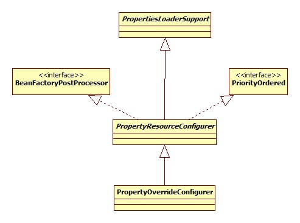

## 运行

入口当然是BeanFactoryPostProcessor.postProcessBeanFactory(PropertyResourceConfigurer):

```Java
@Override
public void postProcessBeanFactory(ConfigurableListableBeanFactory beanFactory) {
    try {
         // 属性加载
        Properties mergedProps = mergeProperties();

        // Convert the merged properties, if necessary.
        convertProperties(mergedProps);

        // Let the subclass process the properties.
        processProperties(beanFactory, mergedProps);
    }
    catch (IOException ex) {
        throw new BeanInitializationException("Could not load properties", ex);
    }
}
```

### 属性加载

PropertiesLoaderSupport.mergeProperties:

```Java
protected Properties mergeProperties() throws IOException {
    Properties result = new Properties();
    if (this.localOverride) {
        // Load properties from file upfront, to let local properties override.
        loadProperties(result);
    }
    if (this.localProperties != null) {
        for (Properties localProp : this.localProperties) {
            CollectionUtils.mergePropertiesIntoMap(localProp, result);
        }
    }
    if (!this.localOverride) {
        // Load properties from file afterwards, to let those properties override.
        loadProperties(result);
    }
    return result;
}
```

可以看出，对local-override的支持是通过改变local和文件两者的加载顺序来实现的。

### 属性转换

convertProperties是个空实现，因为这里并不需要，在bean实际生成的时候才会转换。

### 属性设置

就是逐个属性调用PropertyOverrideConfigurer.applyPropertyValue:

```Java
protected void applyPropertyValue(
        ConfigurableListableBeanFactory factory, String beanName, String property, String value) {

    BeanDefinition bd = factory.getBeanDefinition(beanName);
    while (bd.getOriginatingBeanDefinition() != null) {
        bd = bd.getOriginatingBeanDefinition();
    }
    PropertyValue pv = new PropertyValue(property, value);
    pv.setOptional(this.ignoreInvalidKeys);
    bd.getPropertyValues().addPropertyValue(pv);
}
```

addPropertyValue会遍历PropertyValue链表，找到name相同的进行value替换。

# property-placeholder

这个怎么用已经喜闻乐见了

## 解析

解析的实现类是PropertyPlaceholderBeanDefinitionParser，此类的父类继承体系和property-override的PropertyOverrideBeanDefinitionParser完全一样，所以整体的处理套路也是基本一致。为什么会一致呢，查看此配置拥有的属性就会发现，和property-override很多都是一样的，所以这里只对不一样的而进行说明。

PropertyPlaceholderBeanDefinitionParser.doParse:

```Java
@Override
protected void doParse(Element element, BeanDefinitionBuilder builder) {
    super.doParse(element, builder);
    builder.addPropertyValue("ignoreUnresolvablePlaceholders",
            Boolean.valueOf(element.getAttribute("ignore-unresolvable")));
    String systemPropertiesModeName = element.getAttribute(SYSTEM_PROPERTIES_MODE_ATTRIBUTE);
    if (StringUtils.hasLength(systemPropertiesModeName) &&
            !systemPropertiesModeName.equals(SYSTEM_PROPERTIES_MODE_DEFAULT)) {
        builder.addPropertyValue("systemPropertiesModeName", "SYSTEM_PROPERTIES_MODE_"
            + systemPropertiesModeName);
    }
    if (element.hasAttribute("value-separator")) {
        builder.addPropertyValue("valueSeparator", element.getAttribute("value-separator"));
    }
    if (element.hasAttribute("trim-values")) {
        builder.addPropertyValue("trimValues", element.getAttribute("trim-values"));
    }
    if (element.hasAttribute("null-value")) {
        builder.addPropertyValue("nullValue", element.getAttribute("null-value"));
    }
}
```

### system-properties-mode

Spring会将java的System.getProperties也当做属性的来源，此配置用于设置系统的和本地文件的同名属性的覆盖方式(谁覆盖谁)，自己看文档去。

### value-separator

用于配置默认的值的分隔符:

```xml
<bean id="student" class="base.Student">
    <property name="name" value="${student.name:skywalker}" />
</bean>
```

如果属性文件里没有student.name，那么就是skywalker。默认就是:。

### null-value

遇到哪些值应该当做空处理，比如可以把空串""设为这个，默认不对任何值进行处理。

### trim-values

是否移除开头和结尾的空格，按理说应该是布尔值，但是Spring没有提供可以选择的值，经过测试发现设为true或是false都会把空格干掉，不知道什么鬼。

### BeanDefinition

这次是PropertySourcesPlaceholderConfigurer，其类图:

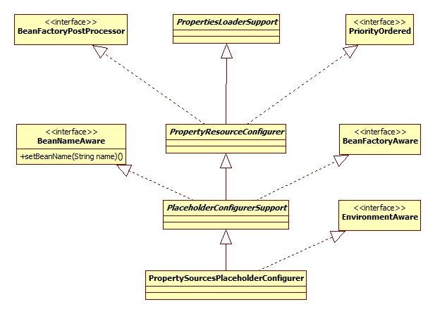

## 运行

PropertySourcesPlaceholderConfigurer.postProcessBeanFactory：

```Java
@Override
public void postProcessBeanFactory(ConfigurableListableBeanFactory beanFactory) throws BeansException {
    if (this.propertySources == null) {
        this.propertySources = new MutablePropertySources();
        if (this.environment != null) {
            this.propertySources.addLast(
                new PropertySource<Environment>(ENVIRONMENT_PROPERTIES_PROPERTY_SOURCE_NAME,
                    this.environment) {
                    @Override
                    public String getProperty(String key) {
                        return this.source.getProperty(key);
                    }
                }
            );
        }
        PropertySource<?> localPropertySource =
                new PropertiesPropertySource(LOCAL_PROPERTIES_PROPERTY_SOURCE_NAME, mergeProperties());
        if (this.localOverride) {
            this.propertySources.addFirst(localPropertySource);
        }
        else {
            this.propertySources.addLast(localPropertySource);
        }
    }
    processProperties(beanFactory, new PropertySourcesPropertyResolver(this.propertySources));
    this.appliedPropertySources = this.propertySources;
}
```

从源码中可以看出，如果其内部的propertySources属性不为空(当然默认是空)，那么属性文件和系统属性都会被忽略。它的使用场景应该是这样:

不使用property-placeholder标签，以显式的bean定义代替。

### 处理

处理的过程就是遍历全部BeanDefinition，替换${}，不再详细进行详细说明。

# load-time-weaver & spring-configured

这两个配置是紧密相关的，所以在一起说了。

load-time-weaver用以开启aspectj类加载期织入，实际上是利用jdk1.6提供的instrument API实现的，原理就是jvm会在类加载之前将class暴露给我们制定的类，允许我们在此时对类进行修改。aspectj便利用此机会根据我们的配置生成对应的满足需求的子类。

可以参考:

[Spring之LoadTimeWeaver——一个需求引发的思考](http://sexycoding.iteye.com/blog/1062372)

[Spring LoadTimeWeaver 的那些事儿](http://www.iteye.com/topic/481813)

## javaagent

要想使用此功能需要配置jvm参数javaagent指定代理类的jar包，示例:

-javaagent:D:\Software\maven-repos\org\springframework\spring-agent\2.5.6.SEC03\spring-agent-2.5.6.SEC03.jar

此jar包的META-INF/MANIFEST.MF文件需要配置如下一行:

Premain-Class: org.springframework.instrument.InstrumentationSavingAge
 nt

Spring的这个jar包只有这一个类，premain方法便是jvm调用的入口，方法参数是固定的。源码:

```Java
public class InstrumentationSavingAgent {

    private static volatile Instrumentation instrumentation;

    public static void premain(String agentArgs, Instrumentation inst) {
        instrumentation = inst;
    }

    public static Instrumentation getInstrumentation() {
        return instrumentation;
    }
}
```

所以，Spring在这里把Instrumentation给暴露了出来，供其它的类使用。

## 解析

解析的实现类是LoadTimeWeaverBeanDefinitionParser，其继承体系和property-override的PropertyOverrideBeanDefinitionParser类似。

### LoadTimeWeaver

此接口用于向ClassLoader添加ClassFileTransformer对象，其继承体系:


LoadTimeWeaverBeanDefinitionParser的父类初始化了一个DefaultContextLoadTimeWeaver类型的BeanDefinition放入容器，类型的决定位于LoadTimeWeaverBeanDefinitionParser.getBeanClassName:

```Java
@Override
protected String getBeanClassName(Element element) {
    // 如果配置了weaver-class属性，那么使用其值
    if (element.hasAttribute(WEAVER_CLASS_ATTRIBUTE)) {
        return element.getAttribute(WEAVER_CLASS_ATTRIBUTE);
    }
    // org.springframework.context.weaving.DefaultContextLoadTimeWeaver
    return DEFAULT_LOAD_TIME_WEAVER_CLASS_NAME;
}
```

那么这个BeanDefinition的id/name又是什么呢?

LoadTimeWeaverBeanDefinitionParser.resolveId:

```Java
@Override
protected String resolveId(Element element, AbstractBeanDefinition definition, ParserContext 	parserContext) {
    // loadTimeWeaver
    return ConfigurableApplicationContext.LOAD_TIME_WEAVER_BEAN_NAME;
}
```

DefaultContextLoadTimeWeaver其实是个包装类，包装了真正的LoadTimeWeaver，使用这层包装的目的就是可以根据外部环境(服务器代理或是Spring自己的代理)确定内部LoadTimeWeaver的实现，具体参见后面运行-BeanClassLoaderAware-setBeanClassLoadery一节。

### LoadTimeWeaverBeanDefinitionParser

LoadTimeWeaverBeanDefinitionParser.doParse:

```Java
@Override
protected void doParse(Element element, ParserContext parserContext, BeanDefinitionBuilder builder) {
    builder.setRole(BeanDefinition.ROLE_INFRASTRUCTURE);
    if (isAspectJWeavingEnabled(element.getAttribute(ASPECTJ_WEAVING_ATTRIBUTE), parserContext)) {
        if (!parserContext.getRegistry().containsBeanDefinition(ASPECTJ_WEAVING_ENABLER_BEAN_NAME)) {
            RootBeanDefinition def = new RootBeanDefinition(ASPECTJ_WEAVING_ENABLER_CLASS_NAME);
            parserContext.registerBeanComponent(
                    new BeanComponentDefinition(def, ASPECTJ_WEAVING_ENABLER_BEAN_NAME));
        }
        if (isBeanConfigurerAspectEnabled(parserContext.getReaderContext().getBeanClassLoader())) {
            new SpringConfiguredBeanDefinitionParser().parse(element, parserContext);
        }
    }
}
```

### aspectj-weaving

这里便是加载其织入的开关，共有三个选项: on, off, autodect。前两个自不必说，autodect表示自动去检测/META-INF下是否存在aop.xml，如果有，那么开启。

此功能依赖于spring-aspectj包，此jar包下有aop.xml，所以autodect也是开启的。

### 是否开启

isAspectJWeavingEnabled方法用于判断是否启用:

```Java
protected boolean isAspectJWeavingEnabled(String value, ParserContext parserContext) {
    if ("on".equals(value)) {
        return true;
    } else if ("off".equals(value)) {
        return false;
    } else {
        // 寻找aop.xml
        ClassLoader cl = parserContext.getReaderContext().getResourceLoader().getClassLoader();
        return (cl.getResource(AspectJWeavingEnabler.ASPECTJ_AOP_XML_RESOURCE) != null);
    }
}
```

### AspectJWeavingEnabler

从源码中可以看出，Spring向容器放了一个这东西，名字叫org.springframework.context.config.internalAspectJWeavingEnabler。这东西用来向LoadTimeWeaver设置aspectj的ClassPreProcessorAgentAdapter对象。其类图:


### SpringConfiguredBeanDefinitionParser

如果isBeanConfigurerAspectEnabled方法返回true，那么将会生成一个此对象并调用其parse方法，查看ContextNamespaceHandler的init方法源码可以发现，spring-configured对应的解析器其实就是它:

```Java
registerBeanDefinitionParser("spring-configured", new SpringConfiguredBeanDefinitionParser());
```

其parse方法:

```Java
@Override
public BeanDefinition parse(Element element, ParserContext parserContext) {
    // org.springframework.context.config.internalBeanConfigurerAspect
    if (!parserContext.getRegistry().containsBeanDefinition(BEAN_CONFIGURER_ASPECT_BEAN_NAME)) {
        RootBeanDefinition def = new RootBeanDefinition();
         // org.springframework.beans.factory.aspectj.AnnotationBeanConfigurerAspect
        def.setBeanClassName(BEAN_CONFIGURER_ASPECT_CLASS_NAME);
        def.setFactoryMethodName("aspectOf");
        def.setRole(BeanDefinition.ROLE_INFRASTRUCTURE);
        def.setSource(parserContext.extractSource(element));
        parserContext.registerBeanComponent(new BeanComponentDefinition
            (def, BEAN_CONFIGURER_ASPECT_BEAN_NAME));
    }
    return null;
}
```

很明显，把org.springframework.beans.factory.aspectj.AnnotationBeanConfigurerAspect添加到容器里了，这其实是一个切面，其类图:

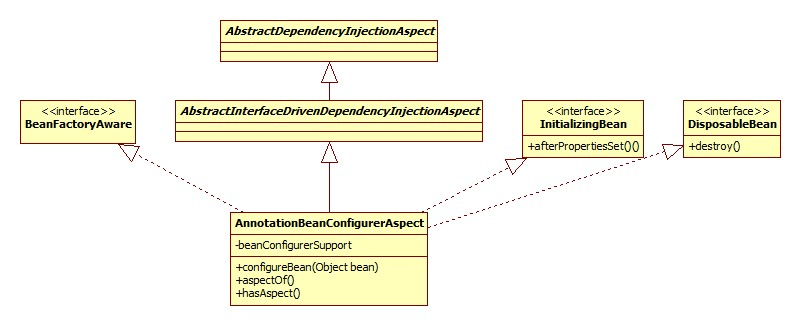

AnnotationBeanConfigurerAspect及其父类其实是由aspectj源文件(.aj)编译而来，所以在spring-aspectj的源码包中看到的是.aj文件而不是.java。

下面就去aj文件中看看到底定义了哪些pointcut以及advise。

语法可以参考:

[Spring 之AOP AspectJ切入点详解](http://jinnianshilongnian.iteye.com/blog/1415606)

#### 切点(pointcut)

##### inConfigurableBean

在AnnotationBeanConfigurerAspect中定义，源码:

```Java
public pointcut inConfigurableBean() : @this(Configurable);
```

@this没找到相关说明，结合@以及this的语义，猜测是匹配**带有@Configurable注解(以及作为元注解)的类**。

##### beanConstruction

源码:

```Java
public pointcut beanConstruction(Object bean) :
            initialization(ConfigurableObject+.new(..)) && this(bean);
```

initialization表示匹配构造器的调用，ConfigurableObject+表示ConfigurableObject及其子类，这就说明可以用实现ConfigurableObject接口的方式代替@Configurable注解。this(bean)表示this必须满足this instanceof bean，也就是说被代理的对象必须是bean的子类。

##### preConstructionCondition

```Java
private pointcut preConstructionCondition() :
            leastSpecificSuperTypeConstruction() && preConstructionConfiguration();
```

由两个pointcut与运算而来。

##### leastSpecificSuperTypeConstruction

```Java
public pointcut leastSpecificSuperTypeConstruction() : initialization(ConfigurableObject.new(..));
```

##### preConstructionConfiguration

```Java
public pointcut preConstructionConfiguration() : preConstructionConfigurationSupport(*);
private pointcut preConstructionConfigurationSupport(Configurable c) : @this(c) && if (c.preConstruction());
```

preConstruction表示@Configurable注解的preConstruction属性，此属性表示是否注入操作可以发生在构造之前，默认false。

##### postConstructionCondition

```Java
private pointcut postConstructionCondition() :
            mostSpecificSubTypeConstruction() && !preConstructionConfiguration();
```

mostSpecificSubTypeConstruction:

```Java
public pointcut mostSpecificSubTypeConstruction() :
            if (thisJoinPoint.getSignature().getDeclaringType() == thisJoinPoint.getThis().getClass());
```

advise可以声明JoinPoint类型的方法参数，thisJoinpoint指的就是这个。此pointcut的目的是匹配接口/抽象类的最具体的实现。

#### advise

##### 前置

```Java
before(Object bean) :
    beanConstruction(bean) && preConstructionCondition() && inConfigurableBean()  {
    configureBean(bean);
}
```

## 运行

AspectJWeavingEnabler.postProcessBeanFactory:

```Java
@Override
public void postProcessBeanFactory(ConfigurableListableBeanFactory beanFactory) throws BeansException {
    enableAspectJWeaving(this.loadTimeWeaver, this.beanClassLoader);
}
```

enableAspectJWeaving:

```Java
public static void enableAspectJWeaving(LoadTimeWeaver weaverToUse, ClassLoader beanClassLoader) {
    // 不为空
    if (weaverToUse == null) {
        if (InstrumentationLoadTimeWeaver.isInstrumentationAvailable()) {
            weaverToUse = new InstrumentationLoadTimeWeaver(beanClassLoader);
        }
        else {
            throw new IllegalStateException("No LoadTimeWeaver available");
        }
    }
    weaverToUse.addTransformer(
            new AspectJClassBypassingClassFileTransformer(new ClassPreProcessorAgentAdapter()));
}
```

### LoadTimeWeaverAware

AspectJWeavingEnabler实现了LoadTimeWeaverAware接口，那么何时由谁进行注入的呢?

当Context初始化时，AbstractApplicationContext.prepareBeanFactory部分源码:

```Java
// loadTimeWeaver
if (beanFactory.containsBean(LOAD_TIME_WEAVER_BEAN_NAME)) {
    beanFactory.addBeanPostProcessor(new LoadTimeWeaverAwareProcessor(beanFactory));
    // Set a temporary ClassLoader for type matching.
    beanFactory.setTempClassLoader(new ContextTypeMatchClassLoader(beanFactory.getBeanClassLoader()));
}
```

很明显，关键在于LoadTimeWeaverAwareProcessor，类图:

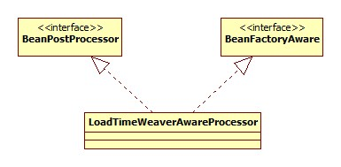

postProcessBeforeInitialization方法:

```Java
@Override
public Object postProcessBeforeInitialization(Object bean, String beanName) {
    if (bean instanceof LoadTimeWeaverAware) {
        LoadTimeWeaver ltw = this.loadTimeWeaver;
        if (ltw == null) {
            Assert.state(this.beanFactory != null,
                "BeanFactory required if no LoadTimeWeaver explicitly specified");
             // 去容器找
            ltw = this.beanFactory.getBean(
                ConfigurableApplicationContext.LOAD_TIME_WEAVER_BEAN_NAME, LoadTimeWeaver.class);
        }
        ((LoadTimeWeaverAware) bean).setLoadTimeWeaver(ltw);
    }
    return bean;
}
```

可以看出，如果本地的loadTimeWeaver为空，那么会去容器找，调用了getBean方法，也就是说DefaultContextLoadTimeWeaver就是在这里初始化的。

BeanFactoryPostProcessor也是一个bean，所以它的初始化也会BeanPostProcessor的处理。不过注意一点:

BeanPostProcessor的注册是在BeanFactoryPostProcessor的调用之后进行的:

AbstractApplicationContext.refresh:

```Java
// Invoke factory processors registered as beans in the context.
invokeBeanFactoryPostProcessors(beanFactory);
// Register bean processors that intercept bean creation.
registerBeanPostProcessors(beanFactory);
```

那么BeanFactoryPostProcessor初始化的时候执行处理的BeanPostProcessor是哪里来的?

AbstractAutowireCapableBeanFactory.applyBeanPostProcessorsBeforeInitialization源码:

```Java
@Override
public Object applyBeanPostProcessorsBeforeInitialization(Object existingBean, String beanName) {
    Object result = existingBean;
    for (BeanPostProcessor beanProcessor : getBeanPostProcessors()) {
        result = beanProcessor.postProcessBeforeInitialization(result, beanName);
        if (result == null) {
            return result;
        }
    }
    return result;
}
```

getBeanPostProcessors:

```Java
public List<BeanPostProcessor> getBeanPostProcessors() {
    return this.beanPostProcessors;
}
```

可以看出，并没有查找容器的过程，所以此处并不会导致BeanPostProcessor的初始化。问题的关键就在于LoadTimeWeaverAwareProcessor的添加方式:

```Java
beanFactory.addBeanPostProcessor(new LoadTimeWeaverAwareProcessor(beanFactory));
```

直接将实例添加到BeanFactory中，所以可以得出结论:

**我们自定义的BeanPostProcessor不会对BeanFactoryPostProcessor的初始化造成影响，除非使用调用BeanFactory.addBeanPostProcessor的方式进行添加**。

### BeanClassLoaderAware

#### 入口

DefaultContextLoadTimeWeaver同样实现了此接口，那么哪里调用的呢?

AbstractAutowireCapableBeanFactory.initializeBean调用了invokeAwareMethods方法，源码:

```Java
private void invokeAwareMethods(final String beanName, final Object bean) {
    if (bean instanceof Aware) {
        if (bean instanceof BeanNameAware) {
            ((BeanNameAware) bean).setBeanName(beanName);
        }
        if (bean instanceof BeanClassLoaderAware) {
            ((BeanClassLoaderAware) bean).setBeanClassLoader(getBeanClassLoader());
        }
        if (bean instanceof BeanFactoryAware) {
            ((BeanFactoryAware) bean).setBeanFactory(AbstractAutowireCapableBeanFactory.this);
        }
    }
}
```

#### setBeanClassLoader

这个方法很关键，对instrument的获取就是在这里。源码:

```Java
@Override
public void setBeanClassLoader(ClassLoader classLoader) {
    LoadTimeWeaver serverSpecificLoadTimeWeaver = createServerSpecificLoadTimeWeaver(classLoader);
    if (serverSpecificLoadTimeWeaver != null) {
        this.loadTimeWeaver = serverSpecificLoadTimeWeaver;
    } else if (InstrumentationLoadTimeWeaver.isInstrumentationAvailable()) {
        this.loadTimeWeaver = new InstrumentationLoadTimeWeaver(classLoader);
    } else {
        this.loadTimeWeaver = new ReflectiveLoadTimeWeaver(classLoader);
    }
}
```

很明显分为三部分。

##### 服务器agent

Spring首先会去检测是否存在服务器的agent代理。按照Spring doc里说的，支持下列服务器:

> ```
> Oracle WebLogic 10,GlassFish 3, Tomcat 6, 7 and 8, JBoss AS 5, 6 and 7, IBM WebSphere 7 and 8.
> ```

createServerSpecificLoadTimeWeaver源码:

```Java
protected LoadTimeWeaver createServerSpecificLoadTimeWeaver(ClassLoader classLoader) {
    String name = classLoader.getClass().getName();
    if (name.startsWith("weblogic")) {
        return new WebLogicLoadTimeWeaver(classLoader);
    } else if (name.startsWith("org.glassfish")) {
        return new GlassFishLoadTimeWeaver(classLoader);
    } else if (name.startsWith("org.apache.catalina")) {
        return new TomcatLoadTimeWeaver(classLoader);
    } else if (name.startsWith("org.jboss")) {
        return new JBossLoadTimeWeaver(classLoader);
    } else if (name.startsWith("com.ibm")) {
        return new WebSphereLoadTimeWeaver(classLoader);
    }
    return null;
}
```

可以看出，**对于服务器的判断是通过检测当前的类加载器来实现的，因为这些服务器都使用了自己的类加载器实现**。

这也从侧面说明，如果当前处于以上服务器所在的web应用环境，不需要spring-agent.jar便可以实现LTW(载入期织入)。

##### Spring agent

这个也是测试时使用的。InstrumentationLoadTimeWeaver.isInstrumentationAvailable：

```Java
public static boolean isInstrumentationAvailable() {
    return (getInstrumentation() != null);
}

private static Instrumentation getInstrumentation() {
    if (AGENT_CLASS_PRESENT) {
        return InstrumentationAccessor.getInstrumentation();
    } else {
        return null;
    }
}
```

AGENT_CLASS_PRESENT是一个布尔变量，就是判断org.springframework.instrument.InstrumentationSavingAgent是否存在，这个便是spring-agent.jar中唯一的类。

InstrumentationAccessor是InstrumentationLoadTimeWeaver的内部类:

```Java
private static class InstrumentationAccessor {
    public static Instrumentation getInstrumentation() {
        return InstrumentationSavingAgent.getInstrumentation();
    }
}
```

这里便是获取spring-agent.jar暴露的Instrumentation对象的地方了。

##### 反射

在这种情况中，Spring寄托于当前的ClassLoader实现了LoadTimeWeaver的功能，也就是必须有addTransformer方法，如果有，Spring便会把LoadTimeWeaver的职责委托给ClassLoader，如果没有只能抛异常了(抱歉，我们没法支持LTW...)，检测的源码位于ReflectiveLoadTimeWeaver的构造器:

```Java
public ReflectiveLoadTimeWeaver() {
    this(ClassUtils.getDefaultClassLoader());
}

public ReflectiveLoadTimeWeaver(ClassLoader classLoader) {
    Assert.notNull(classLoader, "ClassLoader must not be null");
    this.classLoader = classLoader;
    this.addTransformerMethod = ClassUtils.getMethodIfAvailable(
            this.classLoader.getClass(), ADD_TRANSFORMER_METHOD_NAME, ClassFileTransformer.class);
    if (this.addTransformerMethod == null) {
        throw new IllegalStateException();
    }
}
```

##### 总结

其实可以不用Spring，只使用aspectj自己便可以实现LTW，只需要把代理jar包设为aspect-weaver.jar，并自己编写aop.xml文件以及相应的aspect类即可。可以参考官方文档:

[Chapter 5. Load-Time Weaving](http://www.eclipse.org/aspectj/doc/released/devguide/ltw-configuration.html#enabling-load-time-weaving)

### ClassFileTransformer

从enableAspectJWeaving方法的源码可以看出，实际上就是向DefaultContextLoadTimeWeaver添加了一个AspectJClassBypassingClassFileTransformer对象。根据java instrument API的定义，每当一个Class被加载的时候都会去调用挂在Instrumentation上的ClassFileTransformer的transform方法。所以LTW的核心便在这里了。

AspectJClassBypassingClassFileTransformer.transform:

```Java
@Override
public byte[] transform(ClassLoader loader, String className, Class<?> classBeingRedefined,
        ProtectionDomain protectionDomain, byte[] classfileBuffer) {
    // aspectj自身的类无需检测(织入)，直接跳过
    if (className.startsWith("org.aspectj") || className.startsWith("org/aspectj")) {
        return classfileBuffer;
    }
    return this.delegate.transform(loader, className, classBeingRedefined,
        protectionDomain, classfileBuffer);
}
```

delegate是一个org.aspectj.weaver.loadtime.ClassPreProcessorAgentAdapter对象。这是一个适配器模式，其类图:

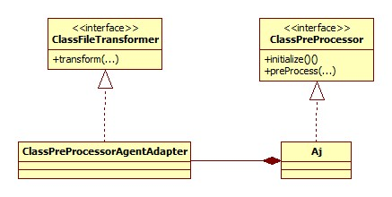

根据Aspectj的doc，ClassPreProcessor用于将Aspectj 5对于jdk5依赖代码抽取出来以便可以支持jdk1.3/1.4.

### Aj

Aj的preProcess方法很长，其实只干了两件事，都是围绕着WeavingAdaptor进行的。对类的处理也转交给WeavingAdaptor的weaveClass方法。

####  缓存

Aj使用了WeavingAdaptor缓存机制，确保一个ClassLoader只有一个WeavingAdaptor对象，因为其初始化的成本很高，缓存利用一个key为AdaptorKey(包装了ClassLoader), value为WeavingAdaptor的HashMap来实现。

#### WeavingAdaptor初始化

初始化就是ClassLoaderWeavingAdaptor.initialize方法，初始化分部分来进行说明。Aspectj部分不再详细展开，只对关键的部分进行说明。

##### aop.xml

###### 解析

aop.xml的解析便是在这里进行。解析的过程无非是xml的解析，下面是其结果如何存储的:

以org.aspectj.weaver.loadtime.definition.Definition为载体，我们以spring-aspects.jar下的aop.xml为例:

```xml
<aspectj>
    <aspects>
        <aspect name="org.springframework.beans.factory.aspectj.AnnotationBeanConfigurerAspect"/>
        <aspect name="org.springframework.scheduling.aspectj.AnnotationAsyncExecutionAspect"/>
        <aspect name="org.springframework.transaction.aspectj.AnnotationTransactionAspect"/>
        <aspect name="org.springframework.transaction.aspectj.JtaAnnotationTransactionAspect"/>
        <aspect name="org.springframework.cache.aspectj.AnnotationCacheAspect"/>
        <aspect name="org.springframework.cache.aspectj.JCacheCacheAspect"/>
    </aspects>
</aspectj>
```

那么解析后的结果:


###### 注册

入口方法在ClassLoaderWeavingAdaptor.registerDefinitions:

```Java
private boolean registerDefinitions(final BcelWeaver weaver, final ClassLoader loader, List<Definition> definitions) {
    //对应<weaver options="-verbose">
    registerOptions(weaver, loader, definitions);
    //对应<exclude>标签
    registerAspectExclude(weaver, loader, definitions);
    //对应<include>标签
    registerAspectInclude(weaver, loader, definitions);
    // <aspect>
    success = registerAspects(weaver, loader, definitions);
    registerIncludeExclude(weaver, loader, definitions);
    //对应<dump>标签
    registerDump(weaver, loader, definitions);
    //忽略返回
}
```

#### 总结

Spring将切面以编译过的Aspectj语言形式定义，不过也可以用原生java类。spring-aspectj包定义的是供各个模块进行LTW的切面。Aspectj部分不再继续向下深入探究。
